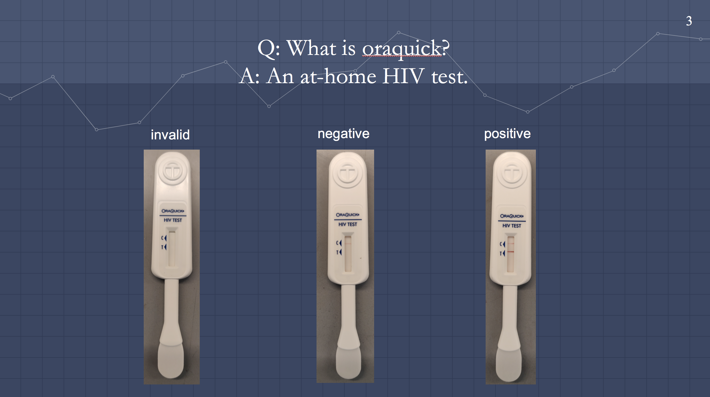
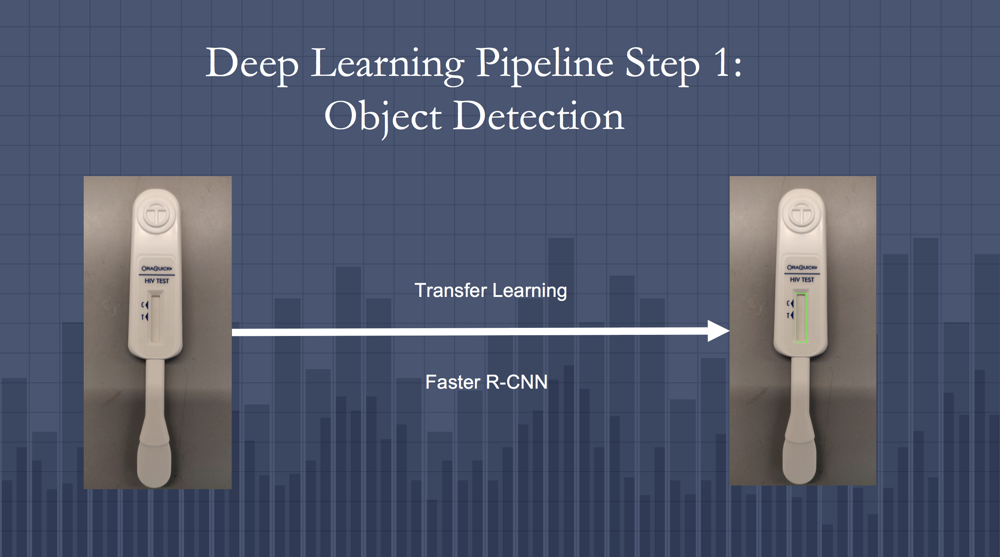
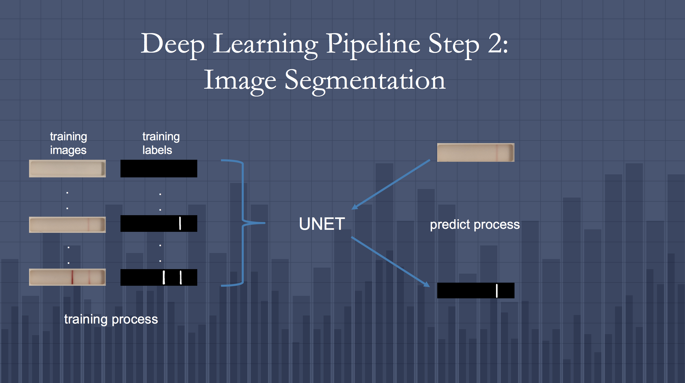
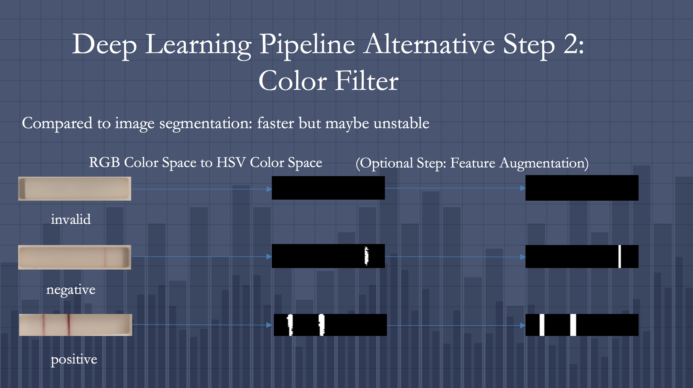
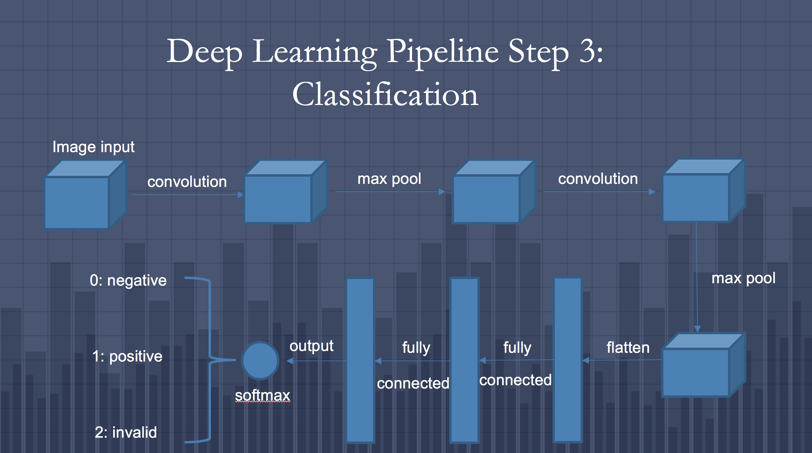
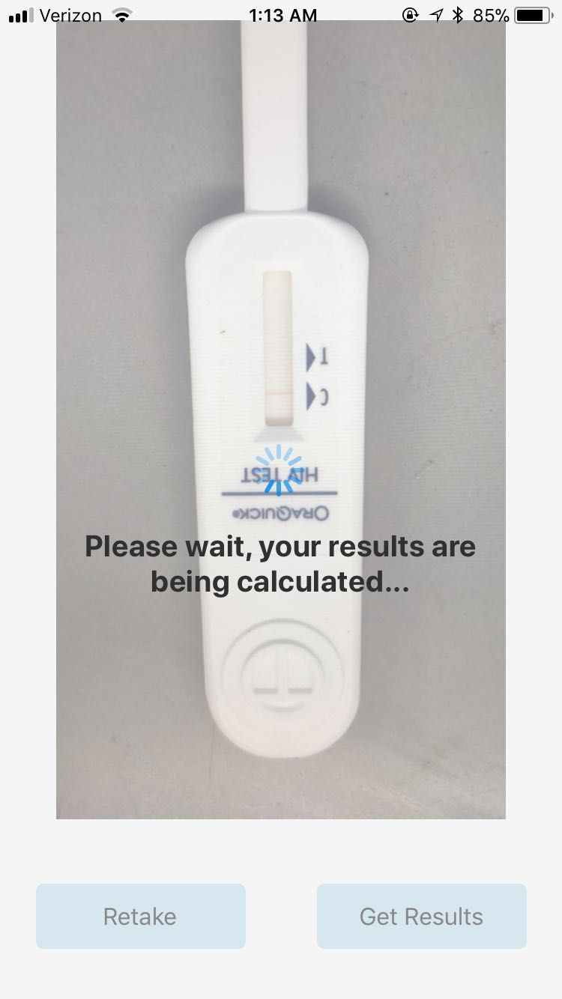
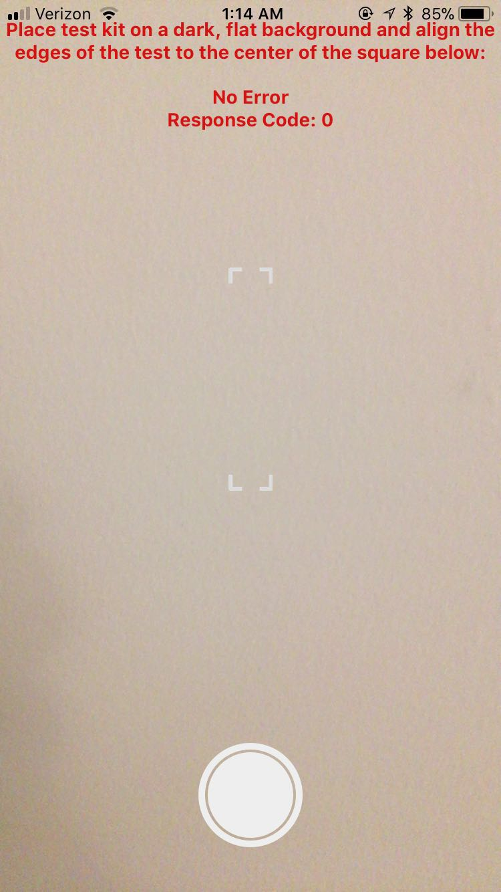

# Deep-Learning-Pipeline-for-Oraquick

# Introduction of the Pipeline

➢	Built a deep learning pipeline on google cloud platform integrated with object detection, image segmentation by UNET and classification by CNN to classify the testing image of Oraquick, which is an at-home HIV test

➢	Detected the square test panel of Oraquick with object detection model trained by transfer learning on the basis of fast CNN trained with COCO dataset, tuned the parameters of UNET with tensorboard and built the classification model of two convolution layers, two max pooling layers and two fully connected layers with tensorflow 

➢	Achieved 100% accuracy on testing images classification and the pipeline is expected to be deployed on SMARTest app

# Introduction of Oraquick

# Panel Detection

For details about how to conduct object detection by transfer learning, please refer to Ongun Uzay Macar's github: https://github.com/ongunuzaymacar/SMARTtest-ml-pipeline

# Image Segmentation

For details about the structure of UNET, please see the thesis in the image_segmentation folder.

# Color Filter (Alternative)

# Classification

# Testing Results Example

# Future Work

1. The selection between image segmentation and color filter is worth further exploring. Validation performance indicates the same accuracy between the two methods. However, the threshold of color filter may vary according to the resolution and condition of the image. That’s why color filter is potentially unstable and image segmentation is preferred. 

2. The training and testing images are all taken by the same phone, thus the good validation performance is not surprising. If the testing images are from a different distribution, the robustness of the pipeline is concerning. But usually the problem could be tackled by mixing pictures from different distributions as well as more augmented pictures as training inputs to retrain the models.

# Acknowledgements

I would like to thank Siddarth, Alex and Ongun at Sia Lab of Columbia University for their contributions to this pipeline. Especially I would like to thank Ongun Uzay Macar for proposing the idea and baseline of this pipeline. If you are interested, please visit his github https://github.com/ongunuzaymacar/SMARTtest-ml-pipeline for his pipeline for insti testkit.

